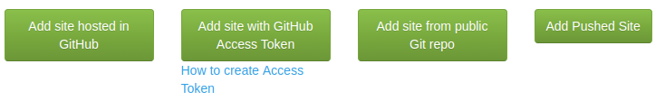
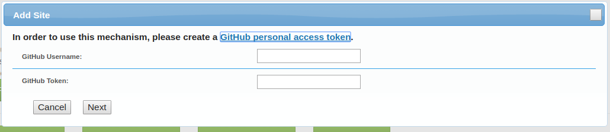
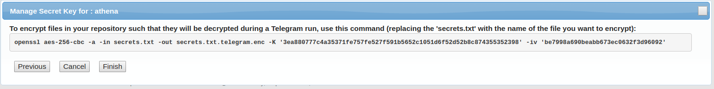

# Telegram #

Telegram is a web application hosting/publishing platform.

Users access the web apps you publish on Telegram via HTTPS... the secure
version of HTTP. You can publish sites to your own domain or to a `*.telegr.am`
domain.

Your web app is composed of static assets (HTML, JavaScript, images, etc.)
served via Telegram’s CDN (Content Delivery Network) plus
HTTPS requests that are proxied (forwarded) to the back end
application that is hosted elsewhere... for example on
[AWS Lambda](https://aws.amazon.com/lambda/).

## Basics

There are 3 phases to publishing a Telegram app: Ingestion, Rendering, and Serving.

### 1 - Ingestion
Ingestion is how you get your code to Telegram. This can be done via a Pushing your code via HTTPS `POST` to Telegram, maintaining the code in a public
[git](https://git-scm.com/) repository, or maintaining the code
on [GitHub](https://github.com).

### 2 - Rendering

Rendering is how the source code that makes up your site into
code that can be delivered to your users. Telegram has built
in support for [Hugo](https://gohugo.io/), [Gatsby](https://www.gatsbyjs.org/), [Jekyll](https://jekyllrb.com/), and 
[Hoisted](/hoisted_howto). Plus you
can define your own transformations in a [Docker](https://docker.com) container.

There can be multiple phases to rendering. This means you can
render your static site and then push a [Serverless](https://serverless.com/) app live.

### 3 - Serving via CDN

Because Telegram’s CDN will proxy HTTPS requests to external
servers, you can deploy your Serverless app on AWS Lambda,
*and* have stable URLs and no [CORS](https://developer.mozilla.org/en-US/docs/Web/HTTP/Access_control_CORS) related issues.

Once all of the rendering phases successfully complete,
Telegram atomically deploys your site to Telegram’s CDN and
Telegram serves requests.

Telegram can serve files, proxy HTTPS, and redirect incoming requests. Because Telegram is serving static content, it’s blazing
fast. Because you can proxy requests to external applications, you
get all the scalability that services like AWS Lambda offer.

This article walks you through each of the phases.

## Ingestion

The code that defines your site can be communicated to Telegram
in 4 different ways:

* Pushing via HTTPS `POST`
* Public Git URL
* GitHub with [Access Token](https://help.github.com/articles/creating-a-personal-access-token-for-the-command-line/)
* GitHub by granting Telegram access rights



### Pushing your site

If you are generating some or all of the final content for your site on another service
like [Travis CI](https://travis-ci.org/), you can push a “tarball” of the site to Telegram.

To set up a Push site, click the “Add Pushed Site” button on the Telegram home screen.

Telegram will present you with a dialog that displays the upload information. In the case of this example,

```
To push code to this repo, make a tar.gz of your site and then upload it:
curl -H “x-secretcode: IYZWLKWN4TB2WPEW4GL40RXT” -X POST —data-binary @mysite.tar.gz https://u.telegr.am/
Copy the x-secretcode information from above. It will only be displayed once. It is the password to upload your site. Anyone with that code can over-write your site.
```

Copy the `x-secretcode` header information. This is the passcode you’ll need to publish your site. It will never be presented again.

Enter a site name. The site name must be unique across all Telegram sites. Your site will be 
served from `https://<sitename>.telegr.am`. Additionally, if you specify a domain name, Telegram
will serve your site at that domain as long as you set the [`CNAME`](https://en.m.wikipedia.org/wiki/CNAME_record) of your domain to `cname.telegr.am`.

To publish your site, create a [gzip’ed tarball](https://www.computerhope.com/jargon/t/tarball.htm) of the source of your site and use [`curl`](https://www.computerhope.com/jargon/t/tarball.htm),
[`wget`](https://www.computerhope.com/jargon/t/tarball.htm), or a similar command to
`POST` the tarball to Telegram. You must include the `x-secretcode` header with the
specified secret in order to successfully upload the site.

**WARNING** The secret code is a password. Treat it like one. If someone gets your
secret code, they will be able to control the content for your domain hosted on Telegram.

Your site is rendered when you push it. The source code that you push is disposed of
after the rendering phase.

### Public Git URL

If you’re hosting a site in a publicly available Git repository, Telegram can pull your
site’s code from a public repository.

To set up the site, click the “Add site from public Git repo” button. Fill in the information
include the site name, the public Git URL (it must be accessible via HTTPS), and optionally
your domain.

Telegram will do a `git clone` or a `git pull` depending if Telegram has a cached copy
of the repo. Once the code is loaded, Telegram will forward the code to the rendering
pipeline.

Your site will *not* automatically update on push. You must click the “Refresh Site”
button to cause Telegram to do a pull and send the site through to the rendering pipeline.

### Add a site Hosted at GitHub

If you have linked your Telegram account with your GitHub account, you will be
presented with the option to add a site hosted at GitHub. 

When you click the “Add site hosted at GitHub” button, Telegram will get a list
of all the repositories you have access to on GitHub and present you with a drop-down
list of the sites. Choose the site, enter the telegram site name, and optional domain
name, and Telegram will do the rest.

Telegram registers a service hook with the GitHub repository so that on each push
to the repository, Telegram will pull the changes, and re-render the site.

After registering the service hook, Telegram will `git clone` the site and send
the repo to the rendering phase.

Your GitHub hosted site will automatically be re-rendered on pushes to the GitHub repo.

### Add a site with GitHub access token

If you do not want to link your GitHub account and Telegram, you can
still access private GitHub repositories from Telegram.

First, you need to create a GitHub [Access Token](https://help.github.com/articles/creating-a-personal-access-token-for-the-command-line/). Once you have an
access token, click the “Add a site with GitHub access token” button.

Telegram will prompt you for your GitHub username and the access token.



If Telegram can authenticate the token, Telegram presents you with a screen
to enter the site name, domain, and `https` based GitHub repo. Telegram
does not support ssh-based Git URLs for access tokens.

Telegram will clone your repo and send the code to the rendering pipeline.

Telegram *does not* register service hooks for access-token based sites.
When you want Telegram to re-render your site, you need to manually
click the “Refresh Site” button.

## Rendering

The rendering phase is a multi-step process to take the the source code
that defines your site and convert it into code that will be served by Telegram's
CDN or a third party service.

The code to render at each phase of the pipeline must be in a public
Docker container. You can specify the pipeline. If you don't
specify the pipeline, Telegram will infer the structure of your project
using the [Build Pipeline](https://github.com/telegr-am/renderers/tree/master/build_pipeline)
heuristics.

### Defining the pipeline

Each phase of the pipeline receives the "input" of the rendering in the `/input`
directory. Input is read-only. The renderer outputs results to the `/output` directory.
When rendering is complete (all the pipeline phases have successfully run),
Telegram takes the content of `/output/html` and sends that to the Telegram CDN.

When Telegram starts rendering your site, it looks for a `.telegram_pipeline.json`
file in the root directory of your site code. If Telegram finds that file, it
will be used to define the rendering. If Telegram cannot find the file, Telegram
will attempt to infer site structure 
using the [Build Pipeline](https://github.com/telegr-am/renderers/tree/master/build_pipeline)
heuristics.

The format of the pipeline JSON file is:

```json
{"version": 1.0, 
 "pipeline": [{"docker": "opentelegram/hugo:latest"},
              {"docker": "opentelegram/serverless:latest",
               "secrets": ["serverless_conf"]}],
 "move_to_input_root": [{"from": "main/_serverless", "to": "serverless"}],
 "ignore_index": false}

```

Here's the meaning of the fields:

* `version` -- the version of the pipeline file. Currently, 1.0 is the only version supported
* `pipeline` -- an array of rendering phases
* `move_to_input_root` -- a set of `from`/`to` pairs that allow moving directories out of the
  `/input/main` directory where the site code is initially placed to other locations. In this
  example, we move the site code's `_serverless` directory to another location in the
  `/input` directory so the content of the HTML renderer (e.g., the Hugo renderer)
  does not try to render the contents of the serverless directory. This field
  is optional.
* `ignore_index` -- Telegram's default behavior is to reject a site that does not have
  an `/output/html/index.html` or similar file (`index.htm`, `home.html`, `home.htm`).
  This is to prevent pushing a site live
  that may not have a landing page. You may be hosting a site on Telegram that does
  not have a landing page. To tell Telegram that it's okay to push a site live that does
  not have a landing page, put `"ignore_index": false` in the pipeline. This field
  is optional.
  
The `pipeline` field contains an array of pipeline phase definitions:

* `docker` -- the public Docker container that will execute the rendering phase.
  You can use the [Telegram renderers](https://hub.docker.com/u/opentelegram/) or
  make your own. Just specify the `docker pull`able image, and that image will
  be used for the rendering.
* `secrets` -- an array of filenames (not paths) of the secrets to make available to
the renderer. The secrets will be in the `/input/_secrets` directory.


### Secrets

There may be cases were you need to store secrets in the code that will be used
in the rendering pipeline. You would not, for example, want to store an
[AWS IAM](https://aws.amazon.com/iam/) in plain text, but the IAM is necessary
for the [Serverless Renderer](https://github.com/telegr-am/renderers/tree/master/serverless)
to push the Serverless part of your site to AWS Lambda.

Telegram supports per-site encryption of secrets that are only decrypted during
site rendering and only made available to specific renderers via an “Allowed List.”

For example, there’s a valid IAM token in the [`serverless_conf.telegram.enc`](https://github.com/telegr-am/serverless_sample/tree/master/_serverless) file. This file can only
be decrypted with a key known to Telegram and to David.

To obtain a per-site encryption key and IV (initialization vector), click the
“Secret” button for your site. Telegram will present you with 
the command to encrypt your file including the Key and the IV. Copy the
key and the IV to a secure location. This is the password for any secrets
you keep in your repository.



When Telegram goes to render a site, it finds all of the files with the suffix
`.telegram.enc`. Telegram moves each of these files to a workspace not
available to the renderers.

Telegram decrypts each file with the shared key/IV. Rendering will fail if
any of the files cannot be decrypted.

For each phase of rendering, Telegram will find all the files listed in the `secrets`
section for that phase of rendering and copy those secrets into the `/input/_secrets`
directory. The specific renderer should look for its secret or secrets in that
directory.


